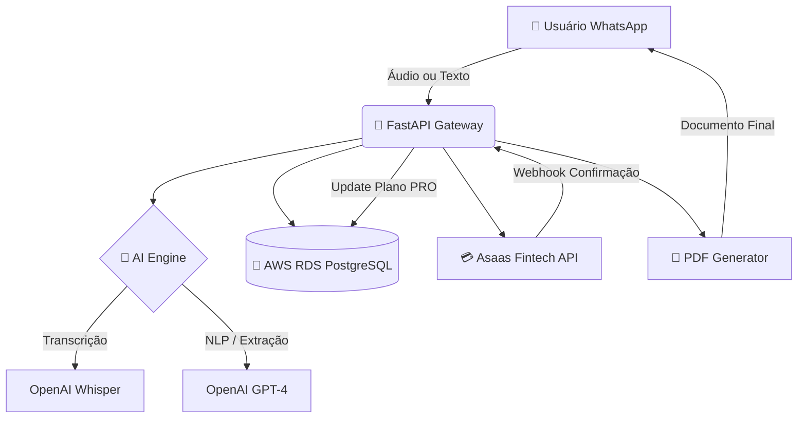

# ⚡ OrçaZap - Inteligência Artificial SaaS para Prestadores de Serviço

**OrçaZap** é uma solução SaaS (Software as a Service) desenvolvida para digitalizar a rotina de profissionais autônomos. Através de uma interface conversacional no **WhatsApp**, o sistema utiliza **Inteligência Artificial Generativa** para automatizar a criação de documentos comerciais, eliminando a burocracia técnica do dia a dia.

---

## 🧪 Teste o OrçaZap Agora!
Quer ver a IA funcionando na prática? Clique no botão abaixo para iniciar uma conversa com o robô:

## 💎 Visão do Produto & Funcionalidades

O OrçaZap foi criado para ser o "braço direito" do prestador de serviço. O profissional não precisa de computador; ele utiliza apenas a voz para:

* **🗣️ Orçamentos via Áudio:** O usuário descreve o serviço falando. A IA transcreve, interpreta e separa automaticamente o custo de **Mão de Obra** vs **Materiais**.
* **🧾 Recibos Instantâneos:** Geração de recibos profissionais com numeração sequencial e **assinatura digital**.
* **📂 Gestão de Documentos:** Histórico completo salvo na nuvem, acessível a qualquer momento.
* **💳 Assinatura PRO:** Sistema de Paywall integrado com a API do **Asaas**. O sistema bloqueia usuários gratuitos que atingem o limite e libera acesso PRO automaticamente após pagamento via Pix.

---

## 🚀 Guia de Uso (Como Funciona)

O fluxo foi desenhado para ser extremamente simples e intuitivo (Conversational UI):

1.  **Início:** O usuário envia `Menu` ou `Oi`.
2.  **Solicitação:** Escolhe, por exemplo, `Novo Orçamento`.
3.  **Interação:** O bot pede os dados. O usuário pode enviar um único áudio dizendo:
    > *"Orçamento para a Dona Maria, troca de fiação completa. Valor total de 2 mil reais, sendo que gastei 500 de material."*
4.  **Processamento:** A IA interpreta o áudio, entende que o lucro (Mão de Obra) é R$ 1.500,00 e o Material é R$ 500,00.
5.  **Entrega:** O sistema gera um PDF profissional, assinado, e envia de volta na conversa em segundos.

---

## 🏗️ Arquitetura e Fluxo de Dados

O sistema utiliza uma arquitetura distribuída, assíncrona e orientada a eventos:

📊 Modelo de Dados (Entity Relationship)
Abaixo está a estrutura relacional que sustenta a persistência de dados e a integridade das transações do sistema:

    PROFISSIONAL ||--o{ ORCAMENTO : gera
    PROFISSIONAL ||--o{ RECIBO : emite
    PLANO ||--o{ PROFISSIONAL : possui
    
    PROFISSIONAL {
        int id PK
        string whatsapp_id UK
        string nome_empresa
        string plano_id FK
    }
    
    ORCAMENTO {
        int id PK
        int numero_sequencial
        float valor_total
        float valor_mao_de_obra
        float valor_materiais
        string cliente_nome
        boolean assinado_digitalmente
    }
    
    RECIBO {
        int id PK
        float valor
        string pagador_nome
        datetime data_emissao
    }
    
    PLANO {
        int id PK
        string nome
        int limite_documentos
    }

| Camada | Tecnologia | Papel no Projeto |
| :--- | :--- | :--- |
| **Backend** | Python / FastAPI | Orquestração de webhooks e lógica de estados assíncrona. |
| **Inteligência Artificial** | OpenAI API | Transcrição de áudio e inteligência para extração de dados. |
| **Infraestrutura** | AWS EC2 / Docker | Hospedagem escalável, containerização e isolamento. |
| **Banco de Dados** | PostgreSQL (RDS) | Persistência de dados com integridade referencial. |
| **Fintech / Pagamentos** | Asaas API | Automação de cobranças e controle de acesso (Paywall). |
| **Interface de Usuário** | WhatsApp Business API | Canal de interação direta e interface conversacional. |

👨‍💻 Diferenciais Técnicos & Desafios Superados
1. Máquina de Estados (FSM)
Implementação de um roteador de mensagens complexo que gerencia o contexto da conversa. O sistema identifica o estado atual do usuário (ex: aguardando_audio, editando_valor), garantindo uma experiência fluida sem perda de contexto.

2. Engenharia de Dados com IA (NLP)
O desafio de transformar fala informal em dados estruturados foi superado através de refinamento de prompts (Prompt Engineering). O sistema é capaz de inferir dados implícitos e corrigir erros de fala do usuário.

3. Cloud Hardening & DevOps
Ambiente configurado na AWS com foco em segurança: uso de variáveis de ambiente restritas, Security Groups protegendo o banco de dados e deploy automatizado via Docker Compose.

🔒 Propriedade Intelectual
Este repositório atua como um Showcase Técnico. Por motivos de estratégia comercial e proteção de propriedade intelectual, o código-fonte deste projeto é privado e proprietário. Esta documentação visa demonstrar competências em Engenharia de Software, Cloud Computing e Implementação de IA.

Desenvolvido por Luis Castelo

